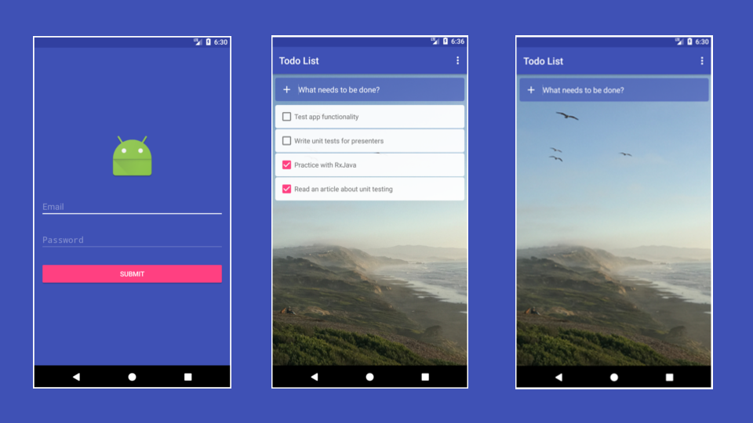

# Android - To Do - MVP

Example of simple android todo application based on Model View Presenter (MVP) architecture.

Libraries used on the sample project
------------------------------------
* [AppCompat, RecyclerView, CardView, Constraint Layout, Design][1]
* [Butterknife][2]
* [Mosby MVP][3]
* [Retrofit 2][4]
* [RxJava & RxAndroid][5]
* [Secure preferences lib][6]
* [Dagger 2][7]
* [Facebook Stetho][8]
* [Espresso framework][9]
* [Mockito][10]
* [Dexmaker][11]
* [Robolectric][12]
* [Mockwebserver][13]

[1]: http://developer.android.com/intl/es/tools/support-library/index.html
[2]: http://jakewharton.github.io/butterknife/
[3]: https://github.com/sockeqwe/mosby
[4]: http://square.github.io/retrofit/
[5]: https://github.com/ReactiveX/RxAndroid
[6]: https://github.com/scottyab/secure-preferences
[7]: https://google.github.io/dagger/
[8]: http://facebook.github.io/stetho/
[9]: https://developer.android.com/training/testing/espresso/index.html
[10]: http://mockito.org/
[11]: https://github.com/linkedin/dexmaker
[12]: http://robolectric.org/
[13]: https://code.google.com/archive/p/mockwebserver/

# Demo

#### Build an application

`./gradlew build`

#### Run local unit tests

`./gradlew test`

#### Run instrumented unit tests

`./gradlew connectedAndroidTest`

#### Unit tests coverage report

`./gradlew testDebugUnitTestCoverage`

*If you want to use Android Flavors feature, please use following:*  
'Flavor' is name of running product flavor. You can find generated report here: /app/build/reports/jacoco/testFlavorDebugUnitTestCoverage/html/intext.html

`./gradlew test<Flavor>DebugUnitTestCoverage`

## REST API Backend

You can use [this project](https://github.com/dmitrykologrivko/django-todo) as a REST API Backend for the app.

## Developed By

Dmitry Kologrivko  - <dmitrykologrivko@gmail.com>